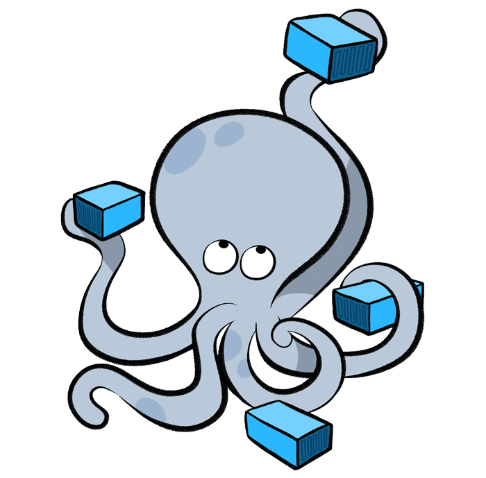

# Requerimientos

Las librerías o paquetes necesarios para el proyecto son:

## Git

::: tip Descripción
Git es un sistema de control de versiones distribuido de código abierto y gratuito diseñado para manejar todo, desde proyectos pequeños a muy grandes, con velocidad y eficiencia.

[Documentación](https://git-scm.com/)
:::

    

## Node y Npm

::: tip Descripción
Ideado como un entorno de ejecución de JavaScript orientado a eventos asíncronos, Node.js está diseñado para crear aplicaciones network escalables. En el siguiente ejemplo de "hola mundo", pueden atenderse muchas conexiones simultáneamente. Por cada conexión, se activa la devolución de llamada o callback, pero si no hay trabajo que hacer, Node.js se dormirá.

[Documentación](https://nodejs.org/es/)
:::

    

## Docker

::: tip Descripción
"Docker", el software de TI, es una tecnología de creación de contenedores que permite la creación y el uso de contenedores de Linux.
Con DOCKER, puede usar los contenedores como máquinas virtuales extremadamente livianas y modulares. Además, obtiene flexibilidad con estos contenedores: puede crearlos, implementarlos, copiarlos y moverlos de un entorno a otro, lo cual le permite optimizar sus aplicaciones para la nube.

[Documentación](https://www.docker.com/)
:::

    

## Docker-Compose

::: tip Descripción
Compose es una herramienta para definir y ejecutar aplicaciones Docker de varios contenedores. Con Compose, usa un archivo YAML para configurar los servicios de su aplicación. Luego, con un solo comando, crea e inicia todos los servicios desde su configuración.

[Documentación](https://docs.docker.com/compose/)
:::

    

